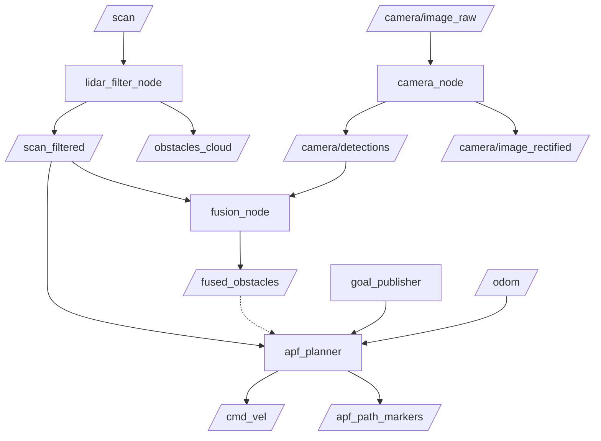

# Path Planning of a Mobile Robot with Real-Time Feedback from Mounted Camera and LiDAR Sensors

## Directory Structure

```
mobile_robot_ws/
├── src/
│   ├── obstacle_msgs/                  # Custom ROS 2 message definitions
│   │   ├── msg/
│   │   │   ├── Obstacle.msg            # Single fused obstacle
│   │   │   └── ObstacleArray.msg       # Array of obstacles
│   │   ├── CMakeLists.txt
│   │   └── package.xml
│   │
│   ├── robot_description/              # Robot URDF + RViz config
│   │   ├── urdf/
│   │   │   └── robot.urdf.xacro        # Differential drive + Hokuyo + Camera
│   │   ├── rviz/
│   │   │   └── robot.rviz              # Full RViz2 display configuration
│   │   ├── launch/
│   │   │   └── display.launch.py       # URDF-only visualisation (no Gazebo)
│   │   ├── CMakeLists.txt
│   │   └── package.xml
│   │
│   ├── robot_simulation/               # Gazebo world + master launch files
│   │   ├── worlds/
│   │   │   └── obstacle_world.world    # World with static boxes + dynamic actors
│   │   ├── scripts/
│   │   │   └── goal_publisher.py       # One-shot goal sender
│   │   ├── launch/
│   │   │   ├── simulation.launch.py    # Gazebo + robot spawn + RViz2
│   │   │   └── full_system.launch.py   # ★ Master launch (all nodes)
│   │   ├── CMakeLists.txt
│   │   └── package.xml
│   │
│   ├── lidar_processing/               # Task B — LiDAR node
│   │   ├── lidar_processing/
│   │   │   ├── __init__.py
│   │   │   └── lidar_filter_node.py    # Filter + median + PointCloud2
│   │   ├── launch/
│   │   │   └── lidar.launch.py
│   │   ├── resource/lidar_processing
│   │   ├── setup.py
│   │   ├── setup.cfg
│   │   └── package.xml
│   │
│   ├── camera_processing/              # Task C — Camera node
│   │   ├── camera_processing/
│   │   │   ├── __init__.py
│   │   │   └── camera_node.py          # Rectify + blur + HSV + ObstacleArray
│   │   ├── launch/
│   │   │   └── camera.launch.py
│   │   ├── resource/camera_processing
│   │   ├── setup.py
│   │   ├── setup.cfg
│   │   └── package.xml
│   │
│   ├── sensor_fusion/                  # Task D — Fusion node
│   │   ├── sensor_fusion/
│   │   │   ├── __init__.py
│   │   │   └── fusion_node.py          # ApproxTimeSync + projection + map
│   │   ├── launch/
│   │   │   └── fusion.launch.py
│   │   ├── resource/sensor_fusion
│   │   ├── setup.py
│   │   ├── setup.cfg
│   │   └── package.xml
│   │
│   └── apf_planner/                    # Task E — APF planner
│       ├── apf_planner/
│       │   ├── __init__.py
│       │   └── apf_node.py             # APF + local minima escape
│       ├── launch/
│       │   └── planner.launch.py
│       ├── resource/apf_planner
│       ├── setup.py
│       ├── setup.cfg
│       └── package.xml
```

---

## Dependencies

### ROS 2 Distribution
- **ROS 2 Jazzy** (Ubuntu 24.04 or Noble)
- **Gazebo Harmonic** (via `gz-sim`)

### ROS 2 Packages
```bash
sudo apt install -y \
  ros-jazzy-ros-gz \
  ros-jazzy-robot-state-publisher \
  ros-jazzy-joint-state-publisher-gui \
  ros-jazzy-tf2-ros \
  ros-jazzy-tf2-geometry-msgs \
  ros-jazzy-tf-transformations \
  ros-jazzy-message-filters \
  ros-jazzy-cv-bridge-msgs \
  ros-jazzy-cv-bridge \
  ros-jazzy-rviz2 \
  python3-opencv \
  python3-scipy \
  python3-numpy \
  python3-transforms3d
```

---

## Build

```bash
cd ~/mobile_robot_ws
colcon build --symlink-install
source install/setup.bash
```

---

## Running

### Option 1 — Full System (Simulation + Fused Perception + APF)
This command handles Gazebo, sensor processing (LiDAR + Camera), fusion, and the autonomous planner.

```bash
# Sourcing (Ensure both ROS and the workspace are sourced)
source /opt/ros/jazzy/setup.bash
source install/setup.bash

# Run the full simulation
ros2 launch robot_simulation full_system.launch.py
```

With a custom goal (optional):
```bash
ros2 launch robot_simulation full_system.launch.py goal_x:=12.0 goal_y:=0.0
```

### Option 2 — Individual Nodes (for debugging)

| Node | Launch Command | Topic Output |
|------|----------------|--------------|
| **Simulation** | `ros2 launch robot_simulation simulation.launch.py` | `/scan`, `/camera/image_raw` |
| **LiDAR Filter** | `ros2 launch lidar_processing lidar.launch.py` | `/scan_filtered` |
| **Camera Proc** | `ros2 launch camera_processing camera.launch.py` | `/camera/detections` |
| **Sensor Fusion** | `ros2 launch sensor_fusion fusion.launch.py` | `/fused_obstacles` |
| **APF Planner** | `ros2 launch apf_planner planner.launch.py` | `/cmd_vel` |

---

## Topic Map



---

## Sensor Specifications

| Sensor | Parameter | Value | Notes |
|--------|-----------|-------|-------|
| **Hokuyo UTM-30LX** | FOV | 270° | Centred on robot front |
| | Angular Res | 0.25° | 1080 rays per scan |
| | Range | 0.1 - 30.0 m | Filtered at 10 Hz |
| **RGB Camera** | Resolution | 640 × 480 | 30 FPS |
| | H-FOV | 80° | Tilted 5° down |
| | Distortion | [0, 0, 0, 0, 0] | Pinhole model (Ideal) |

---

## APF Path Planner

The planner implements an **Artificial Potential Field** (APF) to guide the robot toward a goal while reactively avoiding obstacles.

### Features
- **Conic-Well Attractive Field**: Swaps from quadratic (linear force) to conic (constant force) at a specific distance to prevent unbounded velocities far from the goal.
- **Inverse-Square Repulsive Field**: Obstacles generate a force proportional to $1/d^2$, ensuring strong avoidance as the robot gets closer.
- **Local Minima Recovery**: Automatically detects if the robot is stuck (speed below threshold for >3s) and initiates a random-walk escape manoeuvre.
- **Safety Stop**: Triggers an emergency stop and instant escape if an obstacle is detected within the safety radius.

### Parameters (Latest)

| Parameter | Key | Value | Symbol |
|-----------|-----|-------|--------|
| **Attractive Gain** | `k_att` | **1.2** | $\xi$ |
| **Switch Distance** | `d_star` | **1.5 m** | $d^*$ |
| **Repulsive Gain** | `k_rep` | **1.5** | $\eta$ |
| **Influence Radius** | `d_influence` | **1.0 m** | $\rho_0$ |
| **Safety Radius** | `d_safe` | **0.25 m** | $d_{safe}$ |
| **Max Linear Vel** | `max_linear_vel` | **3.5 m/s** | $v_{max}$ |
| **Max Angular Vel** | `max_angular_vel` | **4.0 rad/s** | $\omega_{max}$ |
| **Force Scaling** | `force_to_vel_scale` | **1.5** | - |

---

## Performance & Known Issues

- **Sensor Fusion**: Now functional with asynchronous TF lookup and ApproximateTime synchronisation.
- **Dynamic Obstacles**: The APF reacts to LiDAR returns instantly; however, fused velocity estimation for better predictive avoidance is a future goal.
- **Map Integration**: Currently operates in the `odom` frame. Migration to `map` frame with SLAM (e.g., Toolbox or Cartographer) is planned for global consistency.
